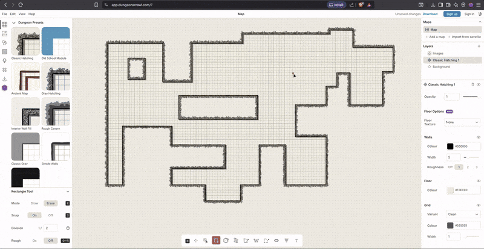
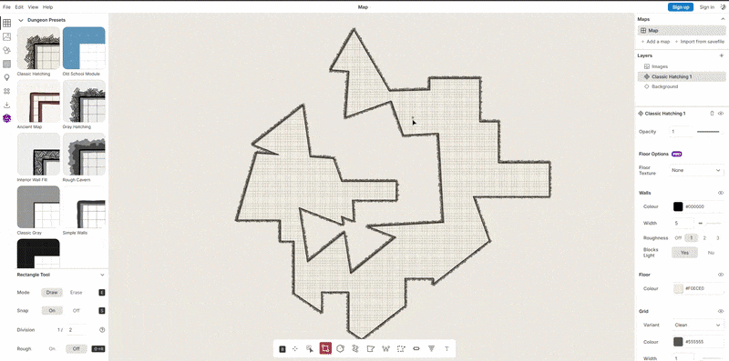

# Baldur's Gate 3 Procedural Generation 🎲⚔️

Ever drawn a dungeon in [Dungeon Scrawl](https://dungeonscrawl.com/) and thought *"man, I wish I could just walk around in this"*? Yeah, same. This project does exactly that — it takes a map you drew and drops it **straight into Baldur's Gate 3** as a playable level. No dark magic required *(well, maybe a little)*.

The whole point is to make D&D **more accessible** for a guy like me.

Grab your friends, pick your characters, and go on an adventure without needing to be a dungeon master veteran to pull it off.


*From a doodle on the web to an actual BG3 map — walls and everything 🗺️*

---

## What it does 🛠️

You draw a dungeon. This tool reads it, figures out where all the walls go, generates the terrain to fit, and spits out all the files BG3 needs to load it as a real level. **No manual placing of objects, no fiddling with the editor** — just run it and go.

- 📄 Parses `.ds` files exported from Dungeon Scrawl
- 📐 Automatically computes how big the terrain needs to be to fit your map
- 🗻 Generates terrain patch files (`.patch`) that BG3 uses for heightmaps
- 🧱 Places wall segments along every corridor and room edge
- 📏 Wall height follows the terrain — no floating walls or sunken ones
- ⚙️ Converts everything to the binary formats BG3 expects using Divine


*Now the terrain actually resizes itself to fit whatever you drew 🙌*

---

## How it works 🔄

1. 🖊️ **Draw your dungeon** in Dungeon Scrawl and export it as a `.ds` file
2. ▶️ **Run the script** — it reads the map, computes bounds, resizes the terrain config, generates heightmap patches, and places all the wall objects
3. 🎉 **Open BG3's editor** (or just load the mod) and your dungeon is there

---

## Requirements 📋

- Python 3.13+
- A copy of Baldur's Gate 3 *(obviously 😄)*
- A Dungeon Scrawl map exported as `.ds`

---

## Setup 🚀

Clone the repo and install dependencies:
```bash
pip install numpy pyrr
```

Point the paths in `convert.py` to your BG3 installation and mod folder, then run:
```bash
python scripts/convert.py
```

---

## Notes 📝

- Walls are placed using in-game assets (like `BLD_Village_Wall_Support_B`) — *you can swap these out for any BG3 object* 🔀
- You still have to generate the AI Grid and also bundle it to your BG3 Mod folder unfortunately 😔

---

## Credits 🙏

Built on top of [lslib / Divine](https://github.com/Norbyte/lslib) by Norbyte for BG3 file format support. *None of this would be possible without that tool* — absolute legend.